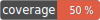

# Country code validators



This component consist of several country code validators.
Validated country code formats:
- alpha2
- alpha3
- full name
- numeric code

It also can validate batch country code values and returns array of invalid given codes (or full name).

## Installation

```php
composer require rocketfellows/iso-standard-3166-validation
```

## Validate alpha2 code usage example

Note: validation case-insensitive.

### Static usage

Valid alpha2 country code:

```php
Alpha2::create()->isValid('DE');
Alpha2::create()->isValid('de');
Alpha2::create()->isValid('De');
Alpha2::create()->isValid('dE');
```

Returns:

```php
true
true
true
true
```

Invalid alpha2 country code:

```php
Alpha2::create()->isValid('OO');
```

Returns:

```php
false
```

### New instance creation usage

Valid alpha2 country code:

```php
$validator = new Alpha2();
$validator->isValid('DE')
```

Returns:

```php
true
```

Invalid alpha2 country code:

```php
$validator = new Alpha2();
$validator->isValid('OO')
```

Returns:

```php
false
```

## Validate alpha3 code usage example

Note: validation case-insensitive.

### Static usage

Valid alpha3 country code:

```php
Alpha3::create()->isValid('GBR')
Alpha3::create()->isValid('gbr')
Alpha3::create()->isValid('Gbr')
```

Returns:

```php
true
true
true
```

Invalid alpha3 country code:

```php
Alpha3::create()->isValid('FOO');
```

Returns:

```php
false
```

### New instance creation usage

Valid alpha3 country code:

```php
$validator = new Alpha3();
$validator->isValid('GBR')
```

Returns:

```php
true
```

Invalid alpha3 country code:

```php
$validator = new Alpha3();
$validator->isValid('FOO')
```

Returns:

```php
false
```

## Validate numeric code usage example

### Static usage

Valid country numeric code:

```php
NumericCode::create()->isValid('646');
```

Returns:

```php
true
```

Invalid country numeric code:

```php
NumericCode::create()->isValid('000');
```

Returns:

```php
false
```

### New instance creation usage

Valid country numeric code:

```php
$validator = new NumericCode();
$validator->isValid('646')
```

Returns:

```php
true
```

Invalid country numeric code:

```php
$validator = new NumericCode();
$validator->isValid('000')
```

Returns:

```php
false
```

## Validate country name usage example

Note: validation case-sensitive.

### Static usage

Valid country name:

```php
Name::create()->isValid('Northern Mariana Islands');
```

Returns:

```php
true
```

Invalid country name:

```php
Name::create()->isValid('foo');
```

Returns:

```php
false
```

### New instance creation usage

Valid country name:

```php
$validator = new Name();
$validator->isValid('Northern Mariana Islands')
```

Returns:

```php
true
```

Invalid country name:

```php
$validator = new Name();
$validator->isValid('foo')
```

Returns:

```php
false
```

## Validate alpha2 batch codes usage example

Note: validation case-insensitive.

### Static usage

Validation:

```php
Alpha2Batch::create()->getInvalidValues(['DE', 'HH', 'BY', 'ZZ', 'GB',]);
```

Returns:

```php
['HH', 'ZZ']
```

### New instance creation usage

Validation:

```php
$validator = new Alpha2Batch(Alpha2::create()); // possible inject other Alpha2 validator implementation
$validator->getInvalidValues(['DE', 'HH', 'BY', 'ZZ', 'GB',]);
```

Returns:

```php
['HH', 'ZZ']
```

## Validate alpha3 batch codes usage example

Note: validation case-insensitive.

### Static usage

Validation:

```php
Alpha3Batch::create()->getInvalidValues(['GBR', 'HH', 'RUS', 'ZZ', 'DEU',]);
```

Returns:

```php
['HH', 'ZZ']
```

### New instance creation usage

Validation:

```php
$validator = new Alpha3Batch(Alpha3::create()); // possible inject other Alpha3 validator implementation
$validator->getInvalidValues(['GBR', 'HH', 'RUS', 'ZZ', 'DEU',]);
```

Returns:

```php
['HH', 'ZZ']
```

## Validate numeric codes batch usage example

### Static usage

Validation:

```php
NumericCodeBatch::create()->getInvalidValues(['882', '000', '674', '111', '678',]);
```

Returns:

```php
['000', '111']
```

### New instance creation usage

Validation:

```php
$validator = new NumericCodeBatch(NumericCode::create()); // possible inject other NumericCode validator implementation
$validator->getInvalidValues(['882', '000', '674', '111', '678',]);
```

Returns:

```php
['000', '111']
```

## Validate country names batch usage example

Note: validation case-sensitive.

### Static usage

Validation:

```php
NameBatch::create()->getInvalidValues(['Samoa', 'foo', 'Sao Tome and Principe', 'bar', 'Saudi Arabia',]);
```

Returns:

```php
['foo', 'bar']
```

### New instance creation usage

Validation:

```php
$validator = new NameBatch(Name::create()); // possible inject other Name validator implementation
$validator->getInvalidValues(['Samoa', 'foo', 'Sao Tome and Principe', 'bar', 'Saudi Arabia',]);
```

Returns:

```php
['foo', 'bar']
```

## Contributing

Welcome to pull requests. If there is a major changes, first please open an issue for discussion.

Please make sure to update tests as appropriate.
